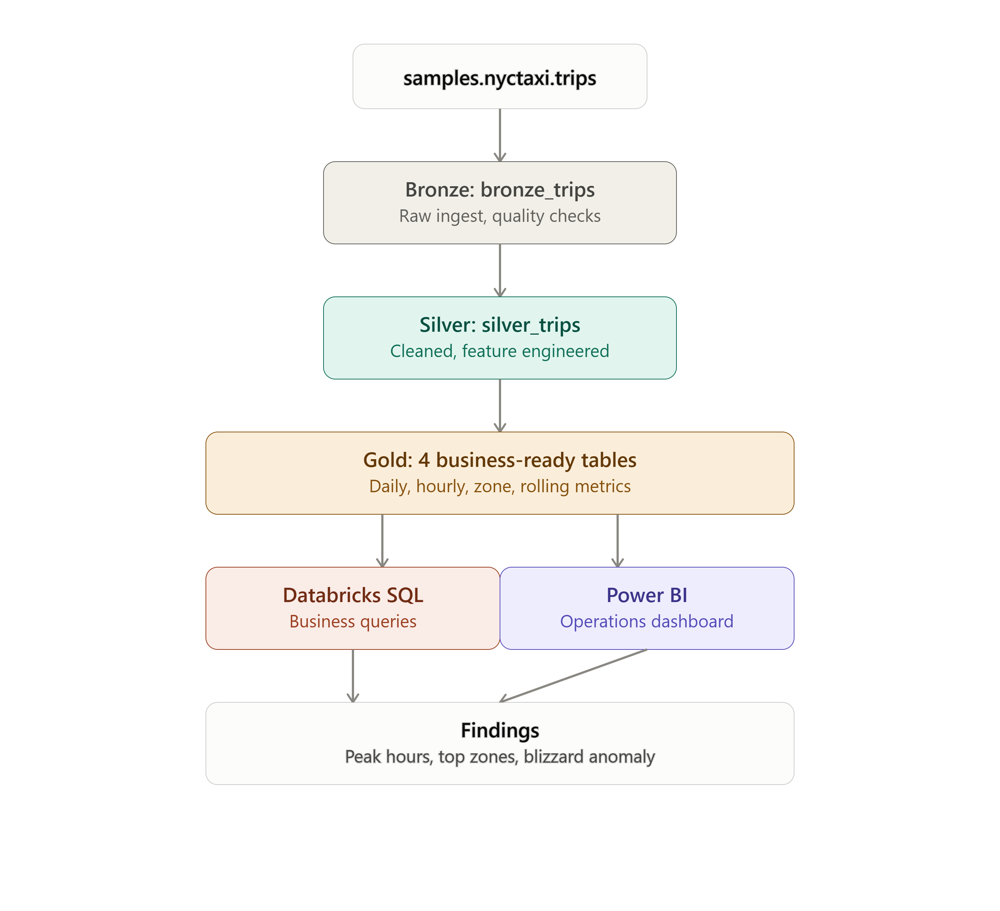
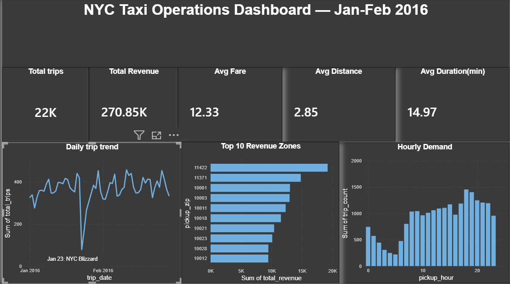

# NYC Taxi Operations Analytics Pipeline

A PySpark/Databricks data pipeline for NYC taxi operations, built on Delta Lake's medallion architecture (Bronze → Silver → Gold), with Databricks SQL analytics and a Power BI dashboard.

## Overview

This project ingests raw NYC taxi trip data, validates and cleans it, engineers time-based features using PySpark window functions, and produces business-ready aggregate tables queried through Databricks SQL and visualized in Power BI. The goal was to demonstrate a real distributed-data pipeline — not just a single-notebook analysis — including deliberate data quality checks before any record reaches the analytical layer.

**Data source:** `samples.nyctaxi.trips` (Databricks' built-in sample dataset, ~22K trip records, Jan–Feb 2016)

## Architecture



| Layer | Table | Purpose |
|---|---|---|
| Bronze | `bronze_trips` | Raw, unmodified copy of source data with quality diagnostics run against it |
| Silver | `silver_trips` | Filtered (invalid fares/timestamps removed) and enriched with derived columns: `trip_duration_minutes`, `pickup_hour`, `day_of_week`, `is_weekend`, `fare_per_mile` |
| Gold | `gold_daily_operations`, `gold_hourly_demand`, `gold_zone_performance`, `gold_rolling_metrics` | Business-ready aggregates, including a 7-day rolling average computed with PySpark window functions |

## Data quality checks (Bronze)

| Check | Result |
|---|---|
| Total rows | 21,932 |
| Null values | 0 across all columns |
| Duplicate rows | 0 |
| Invalid fares (≤ 0) | 10 (excluded in Silver) |
| Zero-distance, nonzero-fare trips | 75 (kept for revenue, excluded from `fare_per_mile`) |
| Invalid timestamps (dropoff ≤ pickup) | 1 (excluded in Silver) |

## Key findings

- **Peak demand** occurs between 6–7 PM; lowest demand is 3–5 AM.
- **Airport ZIPs (11422, 11371)** show significantly higher average fare and trip duration than Manhattan ZIPs — consistent with JFK/LaGuardia airport trips.
- **A sharp, isolated drop in trip volume on Jan 23–24, 2016** was flagged by an automated deviation-from-trend query and corresponds to the historic January 2016 NYC blizzard.

## Tech stack

PySpark · Databricks (Free Edition) · Delta Lake · Databricks SQL · Power BI Desktop

## Repository structure

```
notebooks/       PySpark notebooks (Bronze, Silver, Gold pipeline stages)
sql/              Databricks SQL queries answering specific business questions
powerbi/          Dashboard screenshot
architecture/     Pipeline architecture diagram
```

## Dashboard



## Notes

This project uses Databricks Free Edition, a serverless environment with usage quotas intended for learning and portfolio projects rather than production workloads. The dataset (~22K rows) is a curated sample, not the full NYC TLC trip record volume.
